# TailwindUi Plugin Documentation

- [Installation](installation.md)
- [Class Map System](class-map.md)
- [Helpers](helpers.md)
- [Presets](presets.md) — DaisyUI, KTUI, custom
- [Bake Theme](bake.md)
- [Screenshots](#screenshots)

## Screenshots

Preview of the default DaisyUI preset rendered against the demo app
(see [`dereuromark/cakephp-tailwind-ui-demo`](#demo-app)).

### Form controls

All input types via `$this->Form->control()`: text, email, password, number,
url, tel, date, datetime, time, color, range, textarea, select, multi-select,
checkbox, radio, multi-checkbox, switch, file. Help text, required markers,
validation errors, and horizontal layout are shown.

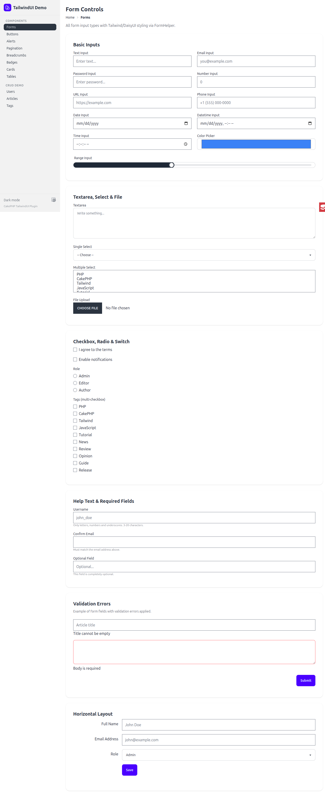

### Buttons

All variants via `$this->Form->submit(text, ['class' => 'primary'])` and
static HTML buttons for reference.

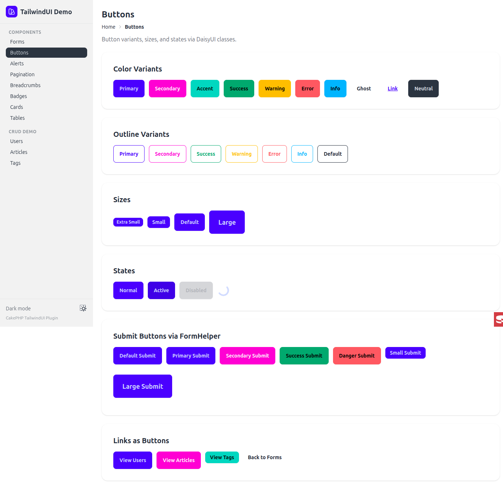

### Flash messages

`$this->Flash->render()` with `alert-success`, `alert-error`, `alert-warning`,
`alert-info` mapping.

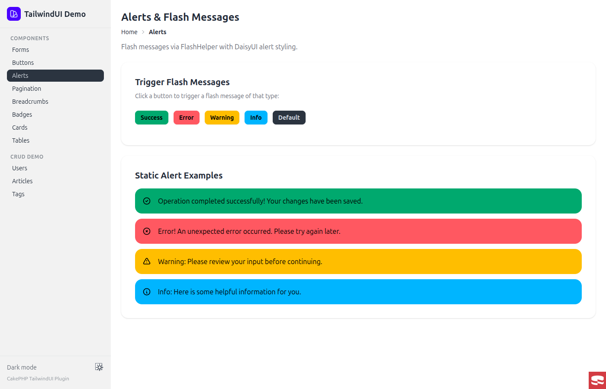

### Pagination

`$this->Paginator->links()` with DaisyUI `join` container.

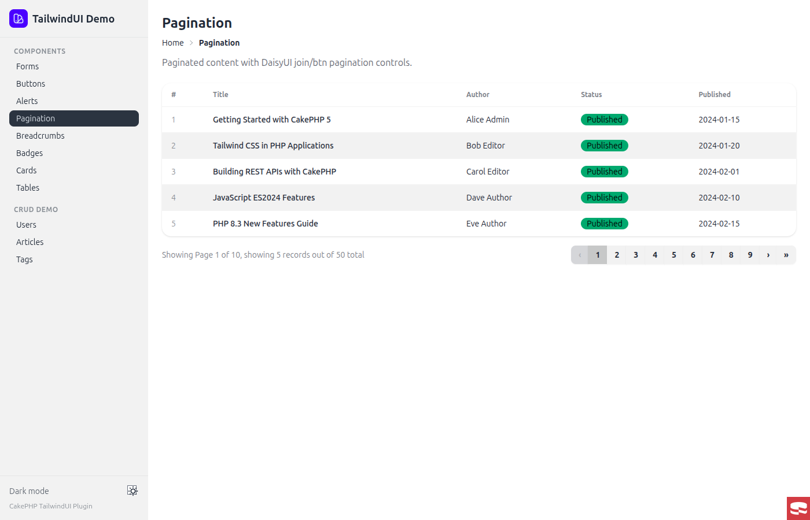

### Breadcrumbs

`$this->Breadcrumbs->render()` using DaisyUI's `breadcrumbs` component.

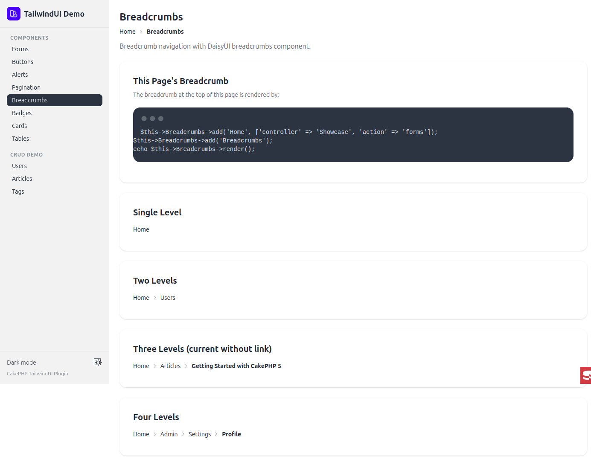

### Badges

`$this->Html->badge(text, ['class' => 'primary'])` with color, outline,
and size variants.

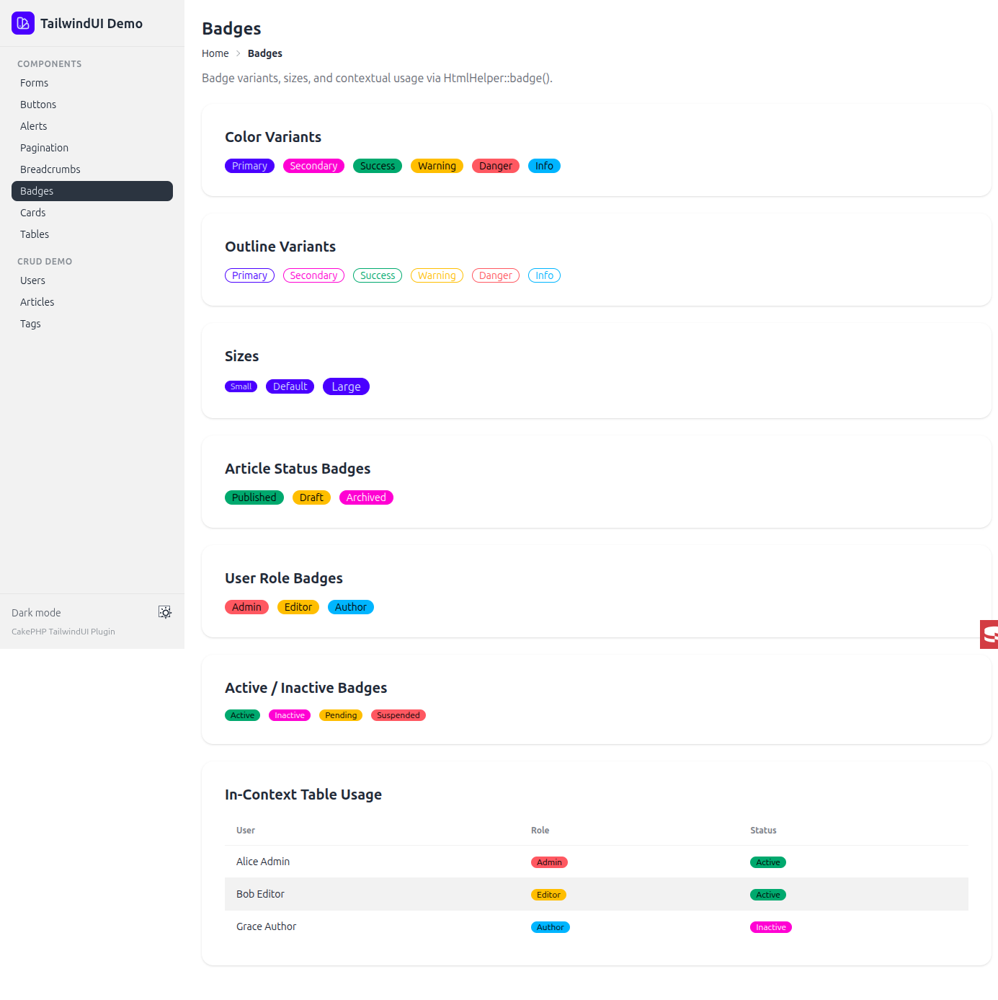

### Cards

Card layouts used in the bake templates.

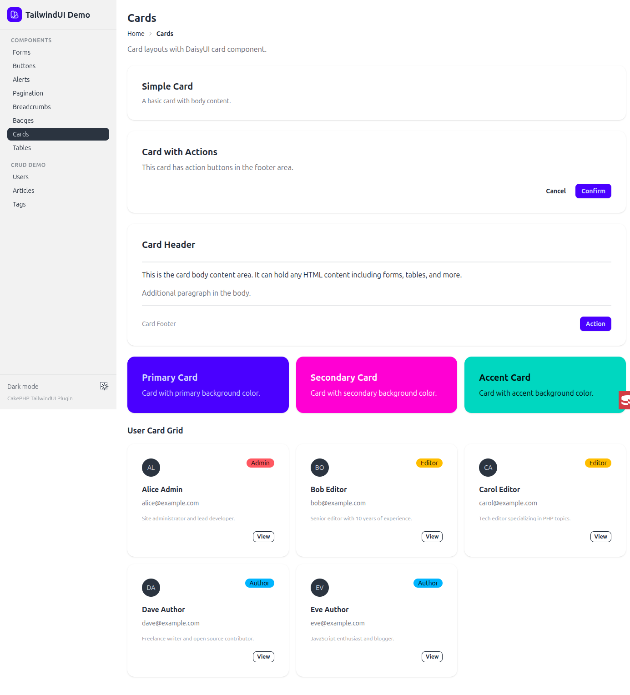

### Tables

Zebra-striped tables with badges inside cells.

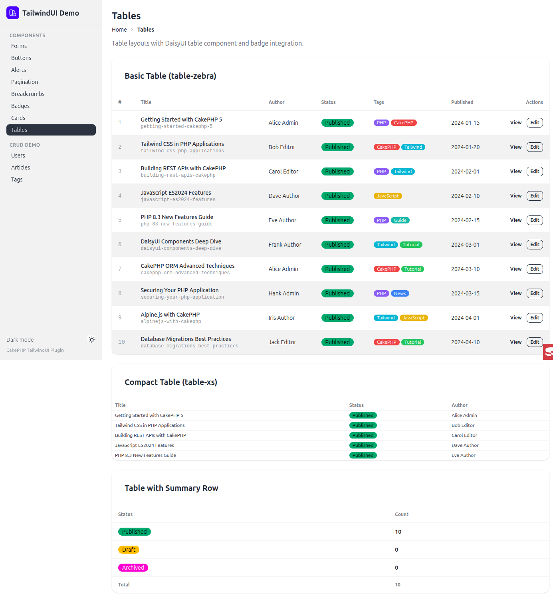

### CRUD pages

Users index — paginated table with role and active badges:

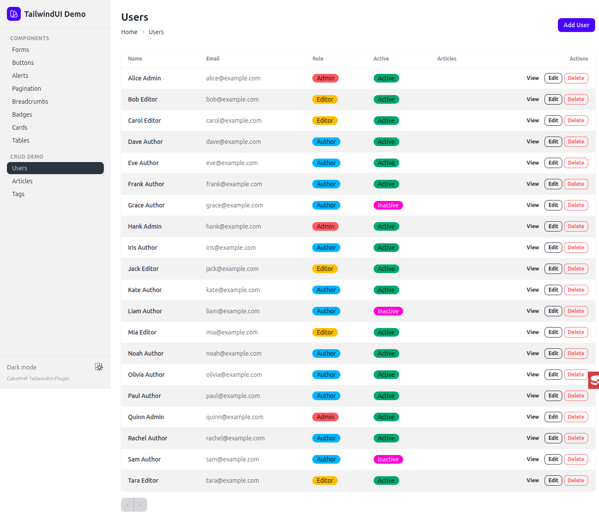

Articles index — paginated table with status and tag badges, search filter:

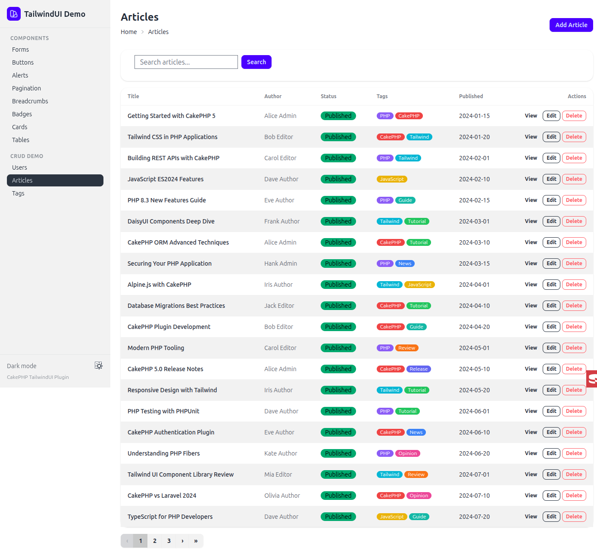

Articles add form — all input types including user select, multi-checkbox
tags, date picker, textarea:

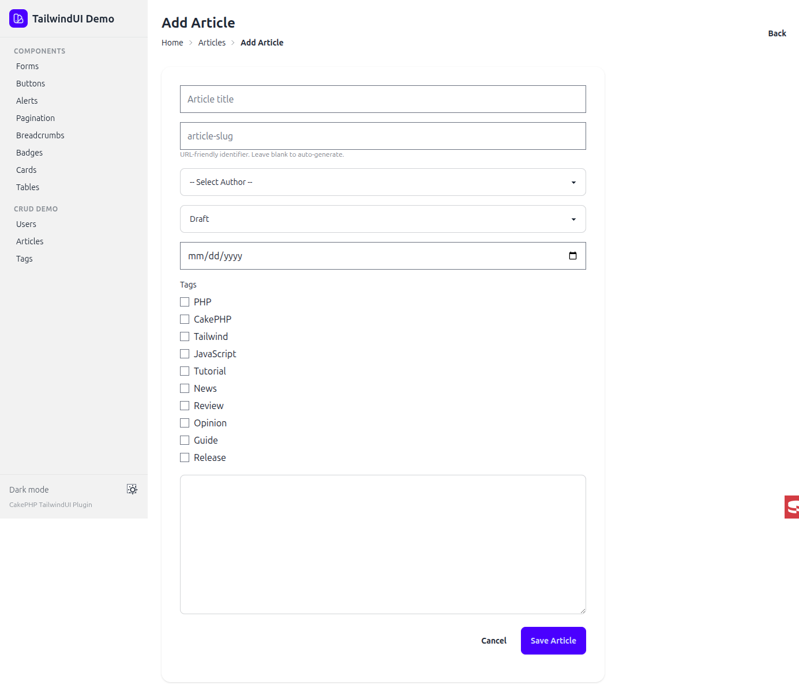

## KTUI preset

The same pages rendered with `Configure::write('TailwindUi.classMap', 'ktui')`.

| Page | DaisyUI | KTUI |
|---|---|---|
| Forms | [daisyui-forms.png](screenshots/daisyui-forms.png) | [ktui-forms.png](screenshots/ktui-forms.png) |
| Buttons | [daisyui-buttons.png](screenshots/daisyui-buttons.png) | [ktui-buttons.png](screenshots/ktui-buttons.png) |
| Pagination | [daisyui-pagination.png](screenshots/daisyui-pagination.png) | [ktui-pagination.png](screenshots/ktui-pagination.png) |
| Users index | [daisyui-users-index.png](screenshots/daisyui-users-index.png) | [ktui-users-index.png](screenshots/ktui-users-index.png) |
| Articles index | [daisyui-articles-index.png](screenshots/daisyui-articles-index.png) | [ktui-articles-index.png](screenshots/ktui-articles-index.png) |
| Articles add | [daisyui-articles-add.png](screenshots/daisyui-articles-add.png) | [ktui-articles-add.png](screenshots/ktui-articles-add.png) |

## Demo app

A separate demo repository that exercises every helper and both presets is
planned. For now, see the `tailwind-ui-demo/` workspace referenced during
development.
